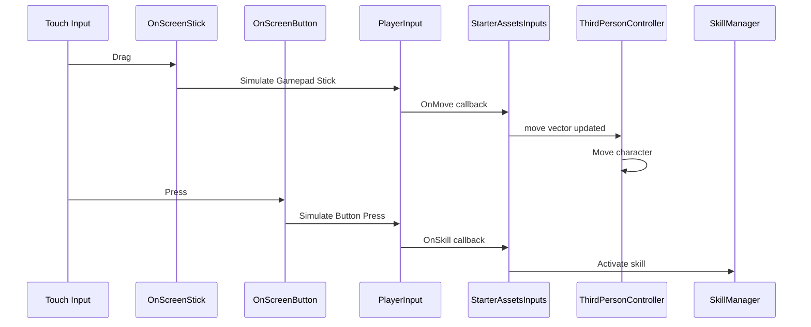

# Design Document: Mobile Input Migration

## Overview

本设计文档描述将现有自定义移动端控制逻辑迁移到 Unity 官方 Input System 方案的技术实现。核心目标是使用 Unity 官方的 `OnScreenStick` 和 `OnScreenButton` 组件替代自定义实现，实现与 `ThirdPersonController` 的无缝集成。

### 迁移原则

1. **官方优先**: 优先使用 Unity 官方组件，减少自定义代码
2. **职责分离**: 输入处理与 UI 视觉效果分离
3. **向后兼容**: 保留技能系统的核心功能
4. **最小改动**: 只修改必要的部分，保持系统稳定

## Architecture

### 迁移前架构

```
┌─────────────────────────────────────────────────────────────┐
│                     Current Architecture                      │
├─────────────────────────────────────────────────────────────┤
│                                                               │
│  ┌──────────────────┐    ┌──────────────────┐                │
│  │ VirtualJoystick  │───▶│ StarterAssetsInputs│               │
│  │   (Custom)       │    │     .MoveInput()   │               │
│  └──────────────────┘    └────────┬───────────┘               │
│                                   │                           │
│  ┌──────────────────┐             ▼                           │
│  │ MobileSkillButton│    ┌──────────────────┐                │
│  │   (Custom)       │───▶│ThirdPersonController│              │
│  └──────────────────┘    │   reads .move     │               │
│                          └──────────────────┘                │
│  ┌──────────────────┐                                        │
│  │ PlayerMovement   │◀── Duplicate movement logic            │
│  │   (Custom)       │                                        │
│  └──────────────────┘                                        │
│                                                               │
└─────────────────────────────────────────────────────────────┘
```

### 迁移后架构

```
┌─────────────────────────────────────────────────────────────┐
│                     Target Architecture                       │
├─────────────────────────────────────────────────────────────┤
│                                                               │
│  ┌──────────────────┐    ┌──────────────────┐                │
│  │  OnScreenStick   │───▶│   PlayerInput    │                │
│  │  (Unity Official)│    │ (Input System)   │                │
│  └──────────────────┘    └────────┬───────────┘               │
│                                   │                           │
│  ┌──────────────────┐             ▼                           │
│  │ OnScreenButton   │    ┌──────────────────┐                │
│  │ (Unity Official) │───▶│StarterAssetsInputs│               │
│  └──────────────────┘    │  (auto-updated)  │                │
│                          └────────┬───────────┘               │
│  ┌──────────────────┐             ▼                           │
│  │SkillButtonVisual │    ┌──────────────────┐                │
│  │  (UI Only)       │    │ThirdPersonController│              │
│  └──────────────────┘    │   (sole mover)   │                │
│                          └──────────────────┘                │
│                                                               │
└─────────────────────────────────────────────────────────────┘
```

### 输入流程



## Components and Interfaces

### 1. OnScreenStick 配置

Unity 官方的 `OnScreenStick` 组件位于 `UnityEngine.InputSystem.OnScreen` 命名空间。

```csharp
// OnScreenStick 关键属性
public class OnScreenStick : OnScreenControl
{
    // 控制路径，绑定到 Input Action
    public string controlPath { get; set; } // 例如: "<Gamepad>/leftStick"
    
    // 移动范围（像素）
    public float movementRange { get; set; }
    
    // 动态定位行为
    public Behaviour behaviour { get; set; }
}
```

**配置方式**:
- 在 UI Image 上添加 `OnScreenStick` 组件
- 设置 `Control Path` 为 `<Gamepad>/leftStick`
- 设置 `Movement Range` 为摇杆背景半径
- 设置 `Behaviour` 为 `Relative Position With Static Origin` 或 `Exact Position With Static Origin`

### 2. OnScreenButton 配置

```csharp
// OnScreenButton 关键属性
public class OnScreenButton : OnScreenControl
{
    // 控制路径，绑定到 Input Action
    public string controlPath { get; set; } // 例如: "<Gamepad>/buttonSouth"
}
```

**配置方式**:
- 在 UI Button/Image 上添加 `OnScreenButton` 组件
- 设置 `Control Path` 为对应的按钮路径

### 3. 扩展 StarterAssetsInputs

```csharp
// 扩展 StarterAssetsInputs 以支持技能输入
namespace StarterAssets
{
    public class StarterAssetsInputs : MonoBehaviour
    {
        // 现有字段
        public Vector2 move;
        public Vector2 look;
        public bool jump;
        public bool sprint;
        
        // 新增技能输入字段
        public bool skill1;
        public bool skill2;
        public bool skill3;
        public bool capture;
        public bool struggle;
        
        // 新增技能输入事件
        public event System.Action OnSkill1Pressed;
        public event System.Action OnSkill2Pressed;
        public event System.Action OnSkill3Pressed;
        public event System.Action OnCapturePressed;
        public event System.Action OnStrugglePressed;
        
        // Input System 回调
        public void OnSkill1(InputValue value)
        {
            skill1 = value.isPressed;
            if (skill1) OnSkill1Pressed?.Invoke();
        }
        
        // ... 其他技能回调
    }
}
```

### 4. SkillButtonVisual 组件（新建）

负责技能按钮的视觉效果，与输入处理分离：

```csharp
namespace PetGrooming.UI.MobileUI
{
    /// <summary>
    /// 技能按钮视觉效果组件，负责冷却显示和动画。
    /// 与 OnScreenButton 输入处理分离。
    /// </summary>
    public class SkillButtonVisual : MonoBehaviour
    {
        [SerializeField] private Image _iconImage;
        [SerializeField] private Image _cooldownOverlay;
        [SerializeField] private TextMeshProUGUI _cooldownText;
        [SerializeField] private Image _glowEffect;
        
        private SkillBase _boundSkill;
        
        public void BindToSkill(SkillBase skill);
        public void UpdateCooldownDisplay(float remaining, float total);
        public void PlayReadyAnimation();
        public void PlayPressAnimation();
    }
}
```

### 5. MobileHUDManager 重构

```csharp
namespace PetGrooming.UI.MobileUI
{
    /// <summary>
    /// 移动端 HUD 管理器（重构版）。
    /// 仅负责 UI 可见性和布局管理，不处理输入。
    /// </summary>
    public class MobileHUDManager : MonoBehaviour
    {
        [Header("OnScreen Controls")]
        [SerializeField] private OnScreenStick _onScreenStick;
        [SerializeField] private OnScreenButton[] _skillButtons;
        
        [Header("Visual Components")]
        [SerializeField] private SkillButtonVisual[] _skillButtonVisuals;
        
        // 启用/禁用移动端控件
        public void EnableMobileControls()
        {
            _onScreenStick.enabled = true;
            foreach (var btn in _skillButtons)
                btn.enabled = true;
        }
        
        public void DisableMobileControls()
        {
            _onScreenStick.enabled = false;
            foreach (var btn in _skillButtons)
                btn.enabled = false;
        }
        
        // 不再有 UpdateMovementInput() 方法
        // 输入完全由 OnScreenStick -> PlayerInput -> StarterAssetsInputs 处理
    }
}
```

## Data Models

### Input Action Asset 扩展

在 `StarterAssets.inputactions` 中添加新的 Action：

```json
{
    "name": "Player",
    "actions": [
        // 现有 actions...
        {
            "name": "Skill1",
            "type": "Button",
            "expectedControlType": "Button"
        },
        {
            "name": "Skill2",
            "type": "Button",
            "expectedControlType": "Button"
        },
        {
            "name": "Skill3",
            "type": "Button",
            "expectedControlType": "Button"
        },
        {
            "name": "Capture",
            "type": "Button",
            "expectedControlType": "Button"
        },
        {
            "name": "Struggle",
            "type": "Button",
            "expectedControlType": "Button"
        }
    ],
    "bindings": [
        // Skill1 绑定
        {
            "path": "<Keyboard>/1",
            "action": "Skill1",
            "groups": "KeyboardMouse"
        },
        {
            "path": "<Gamepad>/buttonWest",
            "action": "Skill1",
            "groups": "Gamepad"
        },
        // Skill2 绑定
        {
            "path": "<Keyboard>/2",
            "action": "Skill2",
            "groups": "KeyboardMouse"
        },
        // Skill3 绑定
        {
            "path": "<Keyboard>/3",
            "action": "Skill3",
            "groups": "KeyboardMouse"
        },
        // Capture 绑定
        {
            "path": "<Keyboard>/e",
            "action": "Capture",
            "groups": "KeyboardMouse"
        },
        {
            "path": "<Gamepad>/buttonSouth",
            "action": "Capture",
            "groups": "Gamepad"
        },
        // Struggle 绑定
        {
            "path": "<Keyboard>/space",
            "action": "Struggle",
            "groups": "KeyboardMouse"
        }
    ]
}
```

### OnScreenButton Control Path 映射

| 按钮 | Control Path | 对应 Action |
|------|-------------|-------------|
| Skill1 (CaptureNet) | `<Gamepad>/buttonWest` | Skill1 |
| Skill2 (Leash) | `<Gamepad>/buttonNorth` | Skill2 |
| Skill3 (CalmingSpray) | `<Gamepad>/buttonEast` | Skill3 |
| Capture | `<Gamepad>/buttonSouth` | Capture |
| Struggle | `<Gamepad>/rightTrigger` | Struggle |

## Correctness Properties

*A property is a characteristic or behavior that should hold true across all valid executions of a system-essentially, a formal statement about what the system should do. Properties serve as the bridge between human-readable specifications and machine-verifiable correctness guarantees.*

### Property 1: OnScreenStick 输入传递

*For any* OnScreenStick 拖动操作，当 stick 被拖动到某个位置时，StarterAssetsInputs.move 应该接收到对应的归一化向量值。

**Validates: Requirements 1.3**

### Property 2: OnScreenButton 动作触发

*For any* OnScreenButton 按下操作，对应的 Input Action 应该被触发，且 StarterAssetsInputs 中对应的技能字段应该被设置为 true。

**Validates: Requirements 2.4**

### Property 3: 控件启用/禁用状态同步

*For any* MobileHUDManager 的 EnableMobileControls/DisableMobileControls 调用，所有 OnScreenControl 组件的 enabled 状态应该与调用一致。

**Validates: Requirements 4.4**

### Property 4: 技能按钮冷却显示同步

*For any* 技能状态变化（冷却开始、冷却中、冷却结束），SkillButtonVisual 的显示状态应该正确反映技能的冷却状态：
- 冷却中：显示冷却遮罩和剩余时间
- 冷却结束：隐藏冷却遮罩，播放就绪动画

**Validates: Requirements 7.1, 7.2, 7.5**

## Error Handling

### 组件缺失处理

```csharp
private void ValidateComponents()
{
    if (_onScreenStick == null)
    {
        Debug.LogError("[MobileHUDManager] OnScreenStick 未配置！");
    }
    
    // 自动查找 PlayerInput
    if (_playerInput == null)
    {
        _playerInput = FindFirstObjectByType<PlayerInput>();
        if (_playerInput == null)
        {
            Debug.LogError("[MobileHUDManager] 场景中未找到 PlayerInput 组件！");
        }
    }
}
```

### 输入绑定验证

```csharp
private void ValidateInputBindings()
{
    var inputActions = _playerInput.actions;
    
    string[] requiredActions = { "Move", "Look", "Jump", "Sprint", 
                                  "Skill1", "Skill2", "Skill3", "Capture", "Struggle" };
    
    foreach (var actionName in requiredActions)
    {
        if (inputActions.FindAction(actionName) == null)
        {
            Debug.LogWarning($"[MobileHUDManager] Input Action '{actionName}' 未在 InputActionAsset 中定义！");
        }
    }
}
```

## Testing Strategy

### 单元测试

由于 Unity Input System 的 OnScreenControl 组件依赖 Unity 运行时，大部分测试需要在 EditMode 或 PlayMode 中进行。

**测试重点**:
1. SkillButtonVisual 的冷却显示计算逻辑
2. MobileHUDManager 的组件启用/禁用逻辑
3. StarterAssetsInputs 扩展的事件触发

### 属性测试

使用 NUnit 的 TestCase 进行参数化测试：

```csharp
[TestFixture]
public class SkillButtonVisualPropertyTests
{
    // Property 4: 技能按钮冷却显示同步
    [TestCase(5f, 10f, true, "5")]  // 冷却中
    [TestCase(0f, 10f, false, "")] // 冷却结束
    [TestCase(0.5f, 10f, true, "1")] // 向上取整
    public void CooldownDisplay_ShouldMatchSkillState(
        float remaining, float total, bool expectedOverlayVisible, string expectedText)
    {
        var (overlayVisible, textVisible, displayText, fillAmount) = 
            SkillButtonVisual.CalculateCooldownDisplayState(remaining, total);
        
        Assert.AreEqual(expectedOverlayVisible, overlayVisible);
        Assert.AreEqual(expectedText, displayText);
    }
}
```

### 集成测试

在 PlayMode 中测试完整的输入链路：

```csharp
[UnityTest]
public IEnumerator OnScreenStick_ShouldUpdateStarterAssetsInputsMove()
{
    // 1. 设置场景
    // 2. 模拟 OnScreenStick 拖动
    // 3. 验证 StarterAssetsInputs.move 值
    yield return null;
}
```

### 测试框架

- **单元测试**: NUnit (Unity Test Framework)
- **属性测试**: NUnit TestCase 参数化
- **集成测试**: Unity Test Framework PlayMode

