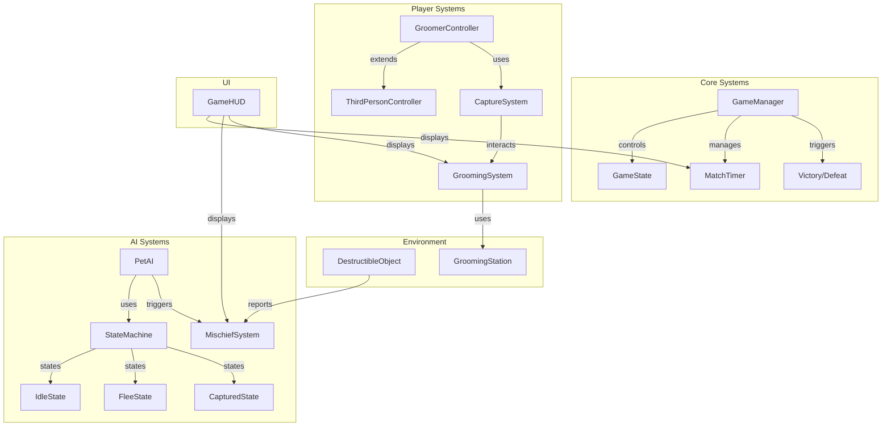

# Design Document: Pet Grooming MVP

## Overview

本设计文档描述宠物洗护对抗游戏 MVP 版本的技术架构和实现方案。MVP 实现单人模式下洗护师与 AI 猫咪的核心对抗循环，基于现有 Unity Starter Assets 框架扩展开发。

### 设计目标

1. 复用现有 ThirdPersonController 作为洗护师控制基础
2. 实现简洁的 AI 状态机控制萌宠行为
3. 建立清晰的游戏状态管理流程
4. 提供直观的 UI 反馈系统

## Architecture



## Components and Interfaces

### 1. GameManager

游戏核心管理器，控制整体游戏流程。

```csharp
public class GameManager : MonoBehaviour
{
    public static GameManager Instance { get; private set; }
    
    public enum GameState { NotStarted, Playing, GroomerWin, PetWin }
    
    public GameState CurrentState { get; private set; }
    public float MatchDuration = 180f; // 3 minutes
    public float RemainingTime { get; private set; }
    
    public event Action<GameState> OnGameStateChanged;
    public event Action<float> OnTimeUpdated;
    
    public void StartMatch();
    public void EndMatch(GameState result);
    public void PauseMatch();
    public void ResumeMatch();
}
```

### 2. GroomerController

扩展现有 ThirdPersonController，添加抓捕和洗护交互能力。

```csharp
public class GroomerController : MonoBehaviour
{
    [Header("Capture Settings")]
    public float CaptureRange = 1.5f;
    public float CarrySpeedMultiplier = 0.85f;
    
    public bool IsCarryingPet { get; private set; }
    public PetAI CapturedPet { get; private set; }
    
    public event Action<PetAI> OnPetCaptured;
    public event Action OnPetEscaped;
    
    public bool TryCapturePet();
    public void ReleasePet();
    public void OnPetEscape();
}
```

### 3. PetAI

AI 控制的萌宠，使用状态机管理行为。

```csharp
public class PetAI : MonoBehaviour
{
    public enum PetState { Idle, Wandering, Fleeing, Captured, BeingGroomed }
    
    [Header("Movement")]
    public float MoveSpeed = 6f;
    public float FleeDistance = 8f;
    public float EscapeTeleportDistance = 3f;
    
    [Header("Struggle")]
    public float BaseEscapeChance = 0.4f;
    public float StruggleInterval = 1f;
    
    public PetState CurrentState { get; private set; }
    
    public event Action OnEscaped;
    public event Action OnGroomingComplete;
    
    public void SetState(PetState newState);
    public void OnCaptured(GroomerController groomer);
    public bool TryEscape();
}
```

### 4. MischiefSystem

管理捣乱值的累积和胜负判定。

```csharp
public class MischiefSystem : MonoBehaviour
{
    public static MischiefSystem Instance { get; private set; }
    
    public int CurrentMischiefValue { get; private set; }
    public int MischiefThreshold = 500;
    
    public event Action<int> OnMischiefValueChanged;
    public event Action OnThresholdReached;
    
    public void AddMischief(int amount);
    public void Reset();
}
```

### 5. GroomingSystem

管理洗护流程的状态和进度。

```csharp
public class GroomingSystem : MonoBehaviour
{
    public enum GroomingStep { None, Brush, Clean, Dry, Complete }
    
    public GroomingStep CurrentStep { get; private set; }
    public float EscapeChanceReduction = 0.1f; // Per step
    
    public event Action<GroomingStep> OnStepChanged;
    public event Action OnGroomingComplete;
    
    public void StartGrooming(PetAI pet);
    public bool TryAdvanceStep(KeyCode inputKey);
    public void CancelGrooming();
    public float GetCurrentEscapeChance();
}
```

### 6. DestructibleObject

可被萌宠撞翻的场景物体。

```csharp
public class DestructibleObject : MonoBehaviour
{
    public enum ObjectType { ShelfItem, CleaningCart }
    
    public ObjectType Type;
    public int MischiefValue => Type == ObjectType.ShelfItem ? 50 : 80;
    public bool IsKnockedOver { get; private set; }
    
    public event Action<DestructibleObject> OnKnockedOver;
    
    public void KnockOver(Vector3 force);
    public void Reset();
}
```

### 7. GroomingStation

洗护台交互点。

```csharp
public class GroomingStation : MonoBehaviour
{
    public Transform GroomingPosition;
    public bool IsOccupied { get; private set; }
    
    public event Action OnGroomingStarted;
    public event Action OnGroomingEnded;
    
    public bool CanStartGrooming(GroomerController groomer);
    public void StartGrooming(GroomerController groomer, PetAI pet);
    public void EndGrooming();
}
```

### 8. GameHUD

游戏界面显示。

```csharp
public class GameHUD : MonoBehaviour
{
    [Header("UI References")]
    public TextMeshProUGUI TimerText;
    public Slider MischiefBar;
    public TextMeshProUGUI MischiefValueText;
    public GameObject GroomingPanel;
    public TextMeshProUGUI GroomingStepText;
    public GameObject CapturePrompt;
    public GameObject GroomPrompt;
    public GameObject ResultPanel;
    public TextMeshProUGUI ResultText;
    
    public void UpdateTimer(float remainingTime);
    public void UpdateMischiefValue(int current, int max);
    public void ShowGroomingStep(GroomingSystem.GroomingStep step);
    public void ShowCapturePrompt(bool show);
    public void ShowGroomPrompt(bool show);
    public void ShowResult(bool groomerWin);
}
```

## Data Models

### GameConfig

```csharp
[CreateAssetMenu(fileName = "GameConfig", menuName = "PetGrooming/GameConfig")]
public class GameConfig : ScriptableObject
{
    [Header("Match Settings")]
    public float MatchDuration = 180f;
    public int MischiefThreshold = 500;
    
    [Header("Groomer Settings")]
    public float GroomerMoveSpeed = 5f;
    public float CaptureRange = 1.5f;
    public float CarrySpeedMultiplier = 0.85f;
    
    [Header("Pet Settings")]
    public float PetMoveSpeed = 6f;
    public float FleeDetectionRange = 8f;
    public float BaseEscapeChance = 0.4f;
    public float EscapeTeleportDistance = 3f;
    public float EscapeChanceReductionPerStep = 0.1f;
    
    [Header("Mischief Values")]
    public int ShelfItemMischief = 50;
    public int CleaningCartMischief = 80;
}
```

### PetStateData

```csharp
[System.Serializable]
public class PetStateData
{
    public PetAI.PetState State;
    public float TimeInState;
    public Vector3 TargetPosition;
    public bool IsStruggling;
    public int GroomingStepsCompleted;
}
```

## Correctness Properties

*A property is a characteristic or behavior that should hold true across all valid executions of a system-essentially, a formal statement about what the system should do. Properties serve as the bridge between human-readable specifications and machine-verifiable correctness guarantees.*

### Property 1: Carry Speed Reduction

*For any* base movement speed value, when the Groomer is carrying a captured pet, the effective movement speed shall equal base speed multiplied by 0.85 (15% reduction).

**Validates: Requirements 1.3**

### Property 2: Pet Spawn Position Validity

*For any* pet spawn event, the spawned position shall be within the defined play area bounds.

**Validates: Requirements 2.1**

### Property 3: Flee State Trigger Distance

*For any* distance between Groomer and Pet, if the distance is less than or equal to 8 units and the Pet is not captured, the Pet shall be in Flee state.

**Validates: Requirements 2.2**

### Property 4: Wander Target Bounds

*For any* wander target generated by the Pet AI in Idle state, the target position shall be within the play area bounds.

**Validates: Requirements 2.3**

### Property 5: Mischief Value Calculation

*For any* destructible object collision, the mischief value shall increase by exactly the object's defined mischief value (50 for shelf items, 80 for cleaning carts).

**Validates: Requirements 2.4, 5.2, 5.3**

### Property 6: Capture Distance Validation

*For any* capture attempt, the attempt shall succeed only if the distance between Groomer and Pet is less than or equal to 1.5 units, and upon success the Pet shall enter Captured state.

**Validates: Requirements 3.1, 3.2**

### Property 7: Escape Teleport Distance

*For any* successful escape attempt, the Pet's new position shall be exactly 3 units away from the Groomer's position.

**Validates: Requirements 3.4**

### Property 8: Grooming Step Sequence

*For any* grooming process, the steps shall always progress in the order: None → Brush → Clean → Dry → Complete, and completing all steps shall mark the Pet as groomed.

**Validates: Requirements 4.2, 4.4, 4.6**

### Property 9: Escape Chance Reduction Formula

*For any* grooming step count n (0 to 3), the Pet's escape chance shall equal (base_chance - n * 0.1), where base_chance is 0.4.

**Validates: Requirements 4.5**

### Property 10: Victory Condition - Mischief Threshold

*For any* game state where mischief value is greater than or equal to 500, the game state shall be PetWin.

**Validates: Requirements 5.5, 6.5**

### Property 11: Victory Condition - Timer Expiry

*For any* game state where timer reaches 0 and Pet is not groomed, the game state shall be PetWin.

**Validates: Requirements 6.3**

### Property 12: Victory Condition - Grooming Complete

*For any* game state where Pet grooming is complete, the game state shall be GroomerWin.

**Validates: Requirements 6.4**

## Error Handling

### Input Validation

1. **Invalid Capture Attempt**: When player attempts capture outside valid range, display "Too far" feedback without changing game state.

2. **Invalid Grooming Input**: When player presses wrong key during grooming, ignore input and maintain current step.

3. **Null Reference Protection**: All component references validated on Start(), with clear error logging if missing.

### State Transition Guards

1. **Capture Guard**: Cannot capture already captured pet or pet being groomed.

2. **Grooming Guard**: Cannot start grooming without captured pet or outside grooming station range.

3. **Game State Guard**: Cannot transition to win state if already in a win state.

### Edge Cases

1. **Simultaneous Events**: If mischief threshold and timer expiry occur in same frame, mischief threshold takes priority.

2. **Escape During Grooming**: If pet escapes during grooming, cancel grooming and return to chase state.

3. **Multiple Destructible Collisions**: Each collision processed independently, mischief values accumulate.

## Testing Strategy

### Unit Tests

Unit tests focus on specific examples and edge cases:

1. **GameManager Tests**
   - Initial state is NotStarted
   - Timer starts at correct value
   - State transitions are valid

2. **MischiefSystem Tests**
   - Initial value is 0
   - Specific object values (50, 80)
   - Threshold detection at exactly 500

3. **GroomingSystem Tests**
   - Step sequence is correct
   - Escape chance calculation at each step
   - Completion detection

### Property-Based Tests

Property-based tests verify universal properties across many generated inputs. Use NUnit with FsCheck for C# property-based testing.

**Test Configuration:**
- Minimum 100 iterations per property test
- Each test tagged with property reference

**Property Test Implementation:**

```csharp
// Example property test structure
[Property]
public Property CarrySpeedReduction()
{
    return Prop.ForAll<float>(baseSpeed =>
    {
        var expectedSpeed = baseSpeed * 0.85f;
        var actualSpeed = CalculateCarrySpeed(baseSpeed);
        return Math.Abs(expectedSpeed - actualSpeed) < 0.001f;
    });
}
```

**Test Tags Format:**
```csharp
// Feature: pet-grooming-mvp, Property 1: Carry Speed Reduction
// Validates: Requirements 1.3
```

### Integration Tests

1. **Capture → Grooming Flow**: Verify complete flow from capture to grooming completion
2. **Mischief → Victory Flow**: Verify mischief accumulation leads to correct victory state
3. **Timer → Victory Flow**: Verify timer expiry leads to correct victory state

