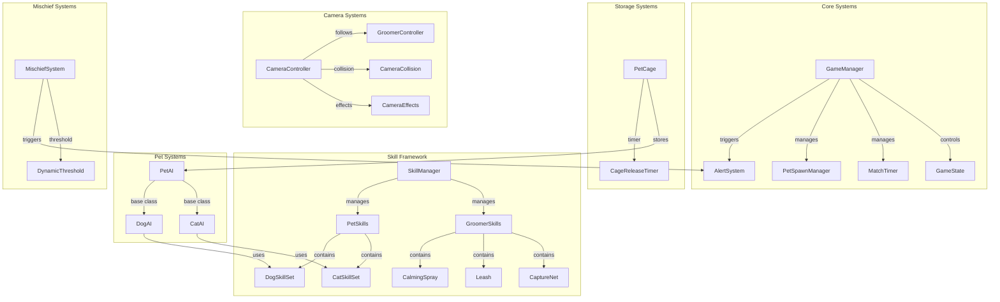

# Design Document: Pet Grooming Phase 2

## Overview

本设计文档描述宠物洗护对抗游戏第二阶段的技术架构和实现方案。在 MVP 基础上扩展多萌宠支持、狗狗角色差异化、角色技能系统、宠物笼机制和智能摄像头系统。

### 设计目标

1. 扩展现有 PetAI 支持猫咪和狗狗两种类型
2. 实现通用技能系统框架，支持洗护师和萌宠技能
3. 实现宠物笼暂存机制
4. 实现智能摄像头跟随系统
5. 扩展捣乱值系统支持动态阈值和警报状态

## Architecture



## Components and Interfaces

### 1. PetSpawnManager

管理多萌宠的生成和追踪。

```csharp
public class PetSpawnManager : MonoBehaviour
{
    public static PetSpawnManager Instance { get; private set; }
    
    public enum GameMode { TwoPets, ThreePets }
    
    [Header("Spawn Settings")]
    public GameMode CurrentMode = GameMode.TwoPets;
    public Transform[] SpawnPoints;
    public GameObject CatPrefab;
    public GameObject DogPrefab;
    
    public List<PetAI> ActivePets { get; private set; }
    public int RemainingPets => ActivePets.Count(p => !p.IsGroomed);
    
    public event Action<PetAI> OnPetSpawned;
    public event Action<PetAI> OnPetGroomed;
    public event Action OnAllPetsGroomed;
    
    public void SpawnPets();
    public void OnPetGroomingComplete(PetAI pet);
    public PetAI GetNearestPet(Vector3 position);
}
```

### 2. SkillBase (抽象基类)

所有技能的基础类。

```csharp
public abstract class SkillBase : MonoBehaviour
{
    [Header("Skill Settings")]
    public string SkillName;
    public float Cooldown;
    public Sprite Icon;
    
    public float RemainingCooldown { get; protected set; }
    public bool IsReady => RemainingCooldown <= 0;
    
    public event Action<float> OnCooldownChanged;
    public event Action OnSkillActivated;
    public event Action OnSkillReady;
    
    public abstract bool CanActivate();
    public abstract void Activate();
    protected virtual void UpdateCooldown();
}
```

### 3. GroomerSkillManager

管理洗护师的所有技能。

```csharp
public class GroomerSkillManager : MonoBehaviour
{
    [Header("Skills")]
    public CaptureNetSkill CaptureNet;
    public LeashSkill Leash;
    public CalmingSpraySkill CalmingSpray;
    
    public SkillBase[] AllSkills => new SkillBase[] { CaptureNet, Leash, CalmingSpray };
    
    public void TryActivateSkill(int skillIndex);
    public SkillBase GetSkill(int index);
}
```

### 4. CaptureNetSkill

捕宠网技能实现。

```csharp
public class CaptureNetSkill : SkillBase
{
    [Header("Capture Net Settings")]
    public float ProjectileSpeed = 15f;
    public float SlowAmount = 0.5f;
    public float SlowDuration = 3f;
    public GameObject NetProjectilePrefab;
    
    public override bool CanActivate();
    public override void Activate();
    private void OnNetHit(PetAI pet);
}
```

### 5. LeashSkill

牵引绳技能实现。

```csharp
public class LeashSkill : SkillBase
{
    [Header("Leash Settings")]
    public float MaxRange = 10f;
    public float PullSpeed = 8f;
    public float CatBreakFreeChance = 0.6f;
    public float DogBreakFreeChance = 0.4f;
    public LineRenderer LeashVisual;
    
    public override bool CanActivate();
    public override void Activate();
    private void OnLeashHit(PetAI pet);
    private bool TryBreakFree(PetAI pet);
}
```

### 6. CalmingSpraySkill

镇静喷雾技能实现。

```csharp
public class CalmingSpraySkill : SkillBase
{
    [Header("Calming Spray Settings")]
    public float EffectRadius = 3f;
    public float StunDuration = 1f;
    public ParticleSystem SprayEffect;
    
    public override bool CanActivate();
    public override void Activate();
    private void ApplyStunEffect(PetAI[] petsInRange);
}
```

### 7. PetSkillManager

管理萌宠的技能（AI 自动使用）。

```csharp
public abstract class PetSkillManager : MonoBehaviour
{
    public abstract SkillBase[] AllSkills { get; }
    public abstract void EvaluateAndUseSkills(PetAI pet, GroomerController groomer);
}
```

### 8. CatSkillManager

猫咪技能管理器。

```csharp
public class CatSkillManager : PetSkillManager
{
    [Header("Cat Skills")]
    public AgileJumpSkill AgileJump;      // CD: 6s
    public FurDistractionSkill FurDistraction;  // CD: 10s
    public HideInGapSkill HideInGap;      // CD: 14s
    
    public override SkillBase[] AllSkills => 
        new SkillBase[] { AgileJump, FurDistraction, HideInGap };
    
    public override void EvaluateAndUseSkills(PetAI pet, GroomerController groomer);
}
```

### 9. DogSkillManager

狗狗技能管理器。

```csharp
public class DogSkillManager : PetSkillManager
{
    [Header("Dog Skills")]
    public PowerChargeSkill PowerCharge;    // CD: 8s
    public IntimidatingBarkSkill IntimidatingBark;  // CD: 12s
    public StealToolSkill StealTool;      // CD: 12s
    
    public override SkillBase[] AllSkills => 
        new SkillBase[] { PowerCharge, IntimidatingBark, StealTool };
    
    public override void EvaluateAndUseSkills(PetAI pet, GroomerController groomer);
}
```

### 10. PetAI 扩展

扩展基础 PetAI 支持类型差异。

```csharp
public enum PetType { Cat, Dog }

public class PetAI : MonoBehaviour
{
    [Header("Pet Type")]
    public PetType Type;
    
    [Header("Type-Specific Settings")]
    public float CollisionRadius => Type == PetType.Cat ? 0.5f : 1.0f;
    public float BaseEscapeChance => Type == PetType.Cat ? 0.4f : 0.3f;
    public float KnockbackForce => Type == PetType.Cat ? 5f : 10f;
    
    [Header("Skill Manager")]
    public PetSkillManager SkillManager;
    
    // 状态效果
    public bool IsSlowed { get; private set; }
    public bool IsStunned { get; private set; }
    public bool IsInvisible { get; private set; }
    public bool IsInvulnerable { get; private set; }
    
    public void ApplySlow(float amount, float duration);
    public void ApplyStun(float duration);
    public void SetInvisible(bool invisible, float opacity = 0.5f);
    public void SetInvulnerable(float duration);
}
```

### 11. PetCage

宠物笼系统。

```csharp
public class PetCage : MonoBehaviour
{
    [Header("Cage Settings")]
    public float MaxStorageTime = 60f;
    public float WarningTime = 10f;
    public Transform StoragePosition;
    public Transform ReleasePosition;
    
    public bool IsOccupied { get; private set; }
    public PetAI StoredPet { get; private set; }
    public float RemainingTime { get; private set; }
    
    public event Action<PetAI> OnPetStored;
    public event Action<PetAI> OnPetReleased;
    public event Action OnWarningStarted;
    
    public bool CanStorePet();
    public void StorePet(PetAI pet);
    public void ReleasePet();
    public void ManualRelease();
}
```

### 12. CameraController

智能摄像头控制器。

```csharp
public class CameraController : MonoBehaviour
{
    [Header("Follow Settings")]
    public Transform Target;
    public float FollowSpeed = 5f;
    public Vector3 DefaultOffset = new Vector3(0, 8, -6);
    public float DefaultFOV = 60f;
    
    [Header("Zoom Settings")]
    public float CaptureZoomOut = 1.2f;
    public float ZoomSpeed = 2f;
    
    [Header("Collision Settings")]
    public float MinDistance = 2f;
    public LayerMask CollisionLayers;
    
    [Header("Boundary Settings")]
    public Bounds SceneBounds;
    
    [Header("Effects")]
    public float AlertShakeIntensity = 0.1f;
    public float AlertShakeDuration = 0.5f;
    
    public void SetGroomingView(Transform groomingStation);
    public void ResetToDefaultView();
    public void TriggerAlertShake();
    private void HandleCollision();
    private void ClampToBounds();
}
```

### 13. AlertSystem

警报系统。

```csharp
public class AlertSystem : MonoBehaviour
{
    public static AlertSystem Instance { get; private set; }
    
    [Header("Alert Settings")]
    public float GroomerSpeedBonus = 0.1f;
    public Light[] AlertLights;
    public AudioSource AlertSound;
    public float FlashInterval = 0.5f;
    
    public bool IsAlertActive { get; private set; }
    
    public event Action OnAlertStarted;
    public event Action OnAlertEnded;
    
    public void StartAlert();
    public void StopAlert();
}
```

### 14. SkillCooldownUI

技能冷却 UI 显示。

```csharp
public class SkillCooldownUI : MonoBehaviour
{
    [Header("UI Elements")]
    public Image SkillIcon;
    public Image CooldownOverlay;
    public TextMeshProUGUI CooldownText;
    public Animator ReadyAnimator;
    
    public void SetSkill(SkillBase skill);
    public void UpdateCooldown(float remaining, float total);
    public void ShowReady();
}
```

## Data Models

### Phase2GameConfig

```csharp
[CreateAssetMenu(fileName = "Phase2GameConfig", menuName = "PetGrooming/Phase2GameConfig")]
public class Phase2GameConfig : ScriptableObject
{
    [Header("Match Settings")]
    public float MatchDuration = 300f; // 5 minutes
    public int TwoPetMischiefThreshold = 800;
    public int ThreePetMischiefThreshold = 1000;
    public int AlertThresholdOffset = 100;
    
    [Header("Pet Cage Settings")]
    public float CageStorageTime = 60f;
    public float CageWarningTime = 10f;
    public float ReleaseInvulnerabilityTime = 3f;
    
    [Header("Groomer Skill Cooldowns")]
    public float CaptureNetCooldown = 8f;
    public float LeashCooldown = 12f;
    public float CalmingSprayCooldown = 13f;
    
    [Header("Cat Skill Cooldowns")]
    public float AgileJumpCooldown = 6f;
    public float FurDistractionCooldown = 10f;
    public float HideInGapCooldown = 14f;
    
    [Header("Dog Skill Cooldowns")]
    public float PowerChargeCooldown = 8f;
    public float IntimidatingBarkCooldown = 12f;
    public float StealToolCooldown = 12f;
    
    [Header("Skill Effects")]
    public float CaptureNetSlowAmount = 0.5f;
    public float CaptureNetSlowDuration = 3f;
    public float LeashCatBreakFreeChance = 0.6f;
    public float LeashDogBreakFreeChance = 0.4f;
    public float CalmingSprayStunDuration = 1f;
    public float FurDistractionDuration = 2f;
    public float HideInGapDuration = 3f;
    public float IntimidatingBarkSlowAmount = 0.2f;
    public float IntimidatingBarkDuration = 3f;
    public float AlertGroomerSpeedBonus = 0.1f;
    
    [Header("Camera Settings")]
    public float CameraFollowSpeed = 5f;
    public Vector3 CameraDefaultOffset = new Vector3(0, 8, -6);
    public float CameraCaptureZoomMultiplier = 1.2f;
    public float CameraMinDistance = 2f;
}
```

### SkillEffectData

```csharp
[System.Serializable]
public class SkillEffectData
{
    public enum EffectType { Slow, Stun, Invisible, SpeedBoost, Invulnerable }
    
    public EffectType Type;
    public float Value;
    public float Duration;
    public float RemainingTime;
}
```


## Correctness Properties

*A property is a characteristic or behavior that should hold true across all valid executions of a system-essentially, a formal statement about what the system should do. Properties serve as the bridge between human-readable specifications and machine-verifiable correctness guarantees.*

### Property 1: Pet Spawn Count Matches Game Mode

*For any* game mode (TwoPets or ThreePets), when a match starts, the number of spawned pets shall equal the mode's pet count (2 or 3), and all spawn positions shall be within the defined play area bounds.

**Validates: Requirements 1.1, 1.2**

### Property 2: Single Pet Carry Constraint

*For any* capture attempt while the Groomer is already carrying a pet, the capture attempt shall fail and the Groomer's carried pet shall remain unchanged.

**Validates: Requirements 1.3**

### Property 3: Pet Cage Storage Duration

*For any* pet stored in a Pet_Cage, the pet shall be automatically released after exactly 60 seconds of storage time.

**Validates: Requirements 1.5, 1.6**

### Property 4: All Pets Groomed Victory Condition

*For any* game state where all spawned pets have been groomed, the game state shall be GroomerWin.

**Validates: Requirements 1.7**

### Property 5: Pet Type Attribute Differences

*For any* pet instance, if the pet type is Dog then collision radius shall be 1.0 and base escape chance shall be 0.3; if the pet type is Cat then collision radius shall be 0.5 and base escape chance shall be 0.4.

**Validates: Requirements 2.2, 2.4**

### Property 6: Dog Knockback Force Greater Than Cat

*For any* collision between a pet and a destructible object, the knockback force applied shall be greater when the pet is a Dog compared to when the pet is a Cat.

**Validates: Requirements 2.3**

### Property 7: Dog Cannot Climb Elevated Surfaces

*For any* elevated surface marked as climbable, a Dog pet shall be unable to navigate to positions on that surface, while a Cat pet shall be able to.

**Validates: Requirements 2.6**

### Property 8: Capture Net Slow Effect

*For any* pet hit by the Capture Net skill, the pet's movement speed shall be reduced by 50% for exactly 3 seconds.

**Validates: Requirements 3.2**

### Property 9: Leash Break Free Chance By Pet Type

*For any* pet hit by the Leash skill, the break free chance shall be 60% for Cat and 40% for Dog.

**Validates: Requirements 3.5**

### Property 10: Calming Spray Stun Effect

*For any* pet within the Calming Spray effect radius, the pet shall be stunned for exactly 1 second.

**Validates: Requirements 3.7**

### Property 11: Hide In Gap Visibility State

*For any* Cat using Hide_In_Gap skill, if the Cat is stationary then opacity shall be 0% (invisible), and if the Cat moves then opacity shall be 50% (semi-transparent).

**Validates: Requirements 4.4, 4.5**

### Property 12: Power Charge Releases Captured Pet

*For any* Groomer carrying a captured pet when hit by Power_Charge skill, the captured pet shall be released immediately.

**Validates: Requirements 5.3**

### Property 13: Intimidating Bark Slow Effect

*For any* Groomer within the Intimidating_Bark effect radius, the Groomer's movement speed shall be reduced by 20% for exactly 3 seconds.

**Validates: Requirements 5.4**

### Property 14: Steal Tool Increases Grooming Steps

*For any* successful Steal_Tool skill activation, the nearest Grooming_Station's required grooming steps shall increase by 1.

**Validates: Requirements 5.5**

### Property 15: Mischief Threshold Matches Game Mode

*For any* game mode, the mischief threshold shall be 800 for TwoPets mode and 1000 for ThreePets mode.

**Validates: Requirements 6.1, 6.2**

### Property 16: Alert State Trigger Condition

*For any* mischief value that reaches (threshold - 100), the alert state shall be active.

**Validates: Requirements 6.3**

### Property 17: Alert State Speed Bonus

*For any* Groomer while alert state is active, the Groomer's movement speed shall be increased by 10%.

**Validates: Requirements 6.5**

### Property 18: Pet Skill Hit Mischief Value

*For any* pet skill that hits the Groomer, the mischief value shall increase by exactly 30 points.

**Validates: Requirements 6.6**

### Property 19: Caged Pet Release Invulnerability

*For any* pet released from Pet_Cage (automatic or manual), the pet shall have invulnerability for exactly 3 seconds.

**Validates: Requirements 8.4**

### Property 20: Caged Pet No Mischief Accumulation

*For any* pet stored in Pet_Cage, any destructible object collisions by that pet shall not add to the mischief value.

**Validates: Requirements 8.6**

### Property 21: Camera Zoom State Consistency

*For any* Groomer state change to carrying a pet, the camera zoom level shall increase; and for any state change to not carrying a pet, the camera zoom level shall return to default.

**Validates: Requirements 9.4, 9.5**

### Property 22: Camera Boundary Clamping

*For any* camera position calculation, the resulting position shall be within the defined scene bounds.

**Validates: Requirements 9.3**

### Property 23: Camera Collision Avoidance

*For any* camera position where an obstacle exists between camera and Groomer, the camera shall move to a position where no obstacle blocks the view.

**Validates: Requirements 9.7, 9.8**

### Property 24: Camera Grooming View Switch

*For any* Groomer entering grooming state at a Grooming_Station, the camera shall switch to the fixed grooming view angle for that station.

**Validates: Requirements 9.6**

## Error Handling

### Input Validation

1. **Invalid Capture While Carrying**: When player attempts capture while already carrying a pet, display "Already carrying a pet" feedback.

2. **Invalid Cage Storage**: When player attempts to store pet in occupied cage, display "Cage is occupied" feedback.

3. **Skill On Cooldown**: When player attempts to use skill on cooldown, display remaining cooldown time and play error sound.

4. **Out of Range Skill**: When Leash skill misses all targets, display "No target hit" feedback.

### State Transition Guards

1. **Capture Guard**: Cannot capture pet that is invulnerable, stunned, or already captured.

2. **Cage Storage Guard**: Cannot store pet if cage is occupied or pet is being groomed.

3. **Skill Activation Guard**: Cannot activate skill if on cooldown or if character is stunned.

4. **Alert State Guard**: Cannot trigger alert if already in alert state or if game has ended.

### Edge Cases

1. **Multiple Pets Hit by Area Skill**: All pets in range receive effect independently.

2. **Pet Released During Alert**: Released pet receives invulnerability but alert state continues.

3. **Skill Effect Overlap**: Multiple slow effects do not stack; strongest effect takes priority.

4. **Camera Obstruction During Grooming**: Grooming view takes priority over collision avoidance.

5. **Pet Escapes While Groomer Moving to Cage**: Groomer returns to chase state, cage remains empty.

## Testing Strategy

### Unit Tests

Unit tests focus on specific examples and edge cases:

1. **PetSpawnManager Tests**
   - Spawn exactly 2 pets in TwoPets mode
   - Spawn exactly 3 pets in ThreePets mode
   - All spawn positions within bounds

2. **SkillBase Tests**
   - Cooldown starts at 0 (ready)
   - Cooldown decreases over time
   - Skill cannot activate while on cooldown

3. **PetCage Tests**
   - Initial state is empty
   - Storage timer starts at 60 seconds
   - Warning triggers at 10 seconds remaining

4. **CameraController Tests**
   - Default offset applied correctly
   - Zoom multiplier applied on capture
   - Boundary clamping works at edges

### Property-Based Tests

Property-based tests verify universal properties across many generated inputs. Use NUnit with FsCheck for C# property-based testing.

**Test Configuration:**
- Minimum 100 iterations per property test
- Each test tagged with property reference

**Property Test Implementation Examples:**

```csharp
// Feature: pet-grooming-phase2, Property 5: Pet Type Attribute Differences
// Validates: Requirements 2.2, 2.4
[Property]
public Property PetTypeAttributeDifferences()
{
    return Prop.ForAll(
        Arb.From<PetType>(),
        petType =>
        {
            var expectedRadius = petType == PetType.Cat ? 0.5f : 1.0f;
            var expectedEscapeChance = petType == PetType.Cat ? 0.4f : 0.3f;
            var pet = CreatePet(petType);
            return pet.CollisionRadius == expectedRadius && 
                   pet.BaseEscapeChance == expectedEscapeChance;
        });
}

// Feature: pet-grooming-phase2, Property 15: Mischief Threshold Matches Game Mode
// Validates: Requirements 6.1, 6.2
[Property]
public Property MischiefThresholdMatchesGameMode()
{
    return Prop.ForAll(
        Arb.From<GameMode>(),
        mode =>
        {
            var expectedThreshold = mode == GameMode.TwoPets ? 800 : 1000;
            var system = CreateMischiefSystem(mode);
            return system.Threshold == expectedThreshold;
        });
}

// Feature: pet-grooming-phase2, Property 16: Alert State Trigger Condition
// Validates: Requirements 6.3
[Property]
public Property AlertStateTriggerCondition()
{
    return Prop.ForAll(
        Gen.Choose(0, 1200).ToArbitrary(),
        Arb.From<GameMode>(),
        (mischiefValue, mode) =>
        {
            var threshold = mode == GameMode.TwoPets ? 800 : 1000;
            var alertTriggerPoint = threshold - 100;
            var system = CreateMischiefSystem(mode);
            system.SetMischiefValue(mischiefValue);
            var shouldBeAlert = mischiefValue >= alertTriggerPoint;
            return system.IsAlertActive == shouldBeAlert;
        });
}
```

**Test Tags Format:**
```csharp
// Feature: pet-grooming-phase2, Property N: Property Title
// Validates: Requirements X.Y
```

### Integration Tests

1. **Multi-Pet Capture Flow**: Verify capture → cage storage → capture second pet → grooming flow
2. **Skill Combat Flow**: Verify skill activation → effect application → cooldown → ready
3. **Alert → Victory Flow**: Verify mischief accumulation → alert trigger → threshold reached → pet victory
4. **Camera State Flow**: Verify follow → capture zoom → grooming view → release reset
